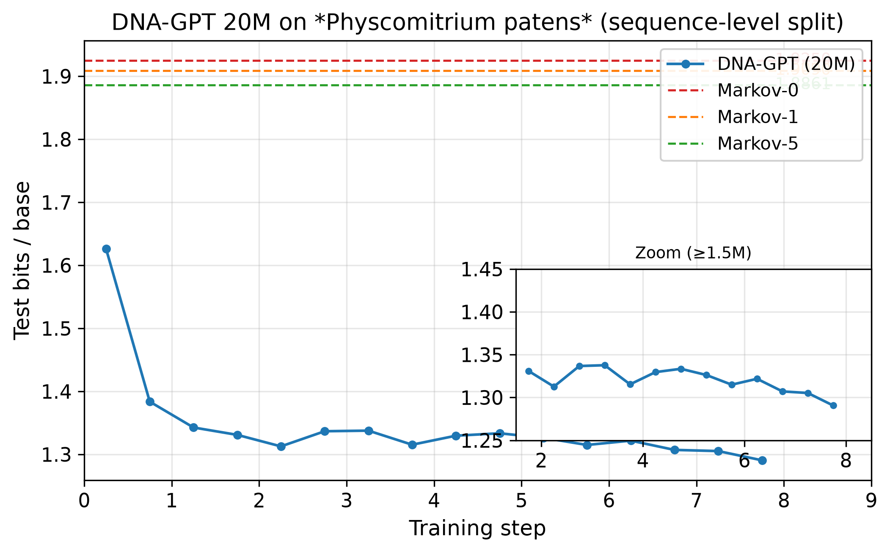

# moss-dna-gpt

Minimal research scaffold for pretraining a small decoder-only Transformer (GPT) on a single moss genome (*Physcomitrium patens*) and comparing held-out next-base prediction against Markov baselines.

**Result:** The 20M-parameter model achieves **1.29 bits/base** vs Markov-5 at **1.886 bits/base** — a clear improvement over classical baselines on this task.

## Results

| Model | bits/base |
|---|---:|
| Markov order 0 | 1.925 |
| Markov order 1 | 1.909 |
| Markov order 5 | 1.886 |
| **DNA-GPT 20M (step 8M)** | **1.291** |



## Quick start

```bash
git clone https://github.com/Unjuno/moss-dna-gpt.git
cd moss-dna-gpt
python -m venv .venv
source .venv/bin/activate
pip install -e ".[dev]"
```

For the Streamlit UI:

```bash
pip install -e ".[app]"
```

## GPU / device check

```bash
python scripts/check_device.py
```

## Real-data quickstart

Fetches the default moss genome, prepares windows, and starts training:

```bash
python scripts/run_real_quickstart.py --profile quick --device auto
```

For the 5M-class MVP:

```bash
python scripts/run_real_quickstart.py --profile 5m --device auto --max-steps 1000
```

## Streamlit DNA completion UI

```bash
streamlit run apps/dna_chat.py -- --checkpoint runs/physcomitrium_patens_quick_256/ckpt_step_50.pt
```

## Test

```bash
pytest
```

## Dummy smoke pipeline

```bash
python scripts/inspect_fasta.py tests/fixtures/dummy.fa
python scripts/prepare_windows.py tests/fixtures/dummy.fa --out-dir data/processed_dummy --block-size 32 --stride 16 --max-n-rate 1.0 --max-windows 4
python scripts/train.py --train-path data/processed_dummy/train.txt --val-path data/processed_dummy/val.txt --run-dir runs/dummy --max-steps 10 --batch-size 2 --n-layer 1 --n-head 1 --n-embd 32 --block-size 32 --device cpu
python scripts/generate.py --checkpoint runs/dummy/ckpt_step_10.pt --prefix ACGT --max-new-tokens 32 --device cpu
python scripts/eval_markov.py --train-path data/processed_dummy/train.txt --test-path data/processed_dummy/test.txt --checkpoint runs/dummy/ckpt_step_10.pt --device cpu
```

## 5M-class training with sharded streaming

```bash
python scripts/prepare_windows.py data/raw/moss/genome.fa.gz --out-dir data/processed --block-size 1024 --stride 512 --max-n-rate 0.2 --shard --shard-size 100000
python scripts/train.py --config configs/train_5m_1024.yaml --streaming --max-steps 1000
```

## Related work

DNA language models and genomic foundation models:

| Model | Year | Architecture | Key idea |
|---|---|---|---|
| **DNABERT** | 2021 | BERT encoder | First DNA LM, k-mer tokenization, 512 bp |
| **DNABERT-2** | 2023 | BERT encoder | BPE tokenization, multi-species |
| **Nucleotide Transformer** | 2023 | BERT encoder | 850 species, up to 2.5B params |
| **HyenaDNA** | 2023 | Decoder (Hyena) | 1M token context, single-nucleotide |
| **DNAGPT** | 2023 | GPT decoder | Multi-task pre-training |
| **Caduceus** | 2024 | SSM (Mamba) | Bidirectional, RC-equivariant |
| **GROVER** | 2024 | BERT encoder | BPE for human genome |
| **Evo** | 2024 | StripedHyena | Genome-scale generative model |
| **MambaDNA** | 2024 | SSM (Mamba) | Bidirectional, single-nucleotide |
| **Evo 2** | 2025 | StripedHyena | 40B params, all domains of life |
| **Omni-DNA** | 2025 | GPT decoder | Multi-task, 20M-1B params |
| **Carbon** | 2026 | Llama decoder | 3B/8B params, eukaryotic-focused |

## Safety

Only load checkpoints from trusted sources. PyTorch `.pt` files may execute unsafe pickle payloads on older versions.

Lower DNA-GPT loss than Markov baselines does **not** prove functional understanding, SNP effect prediction, or cross-species generalization.
